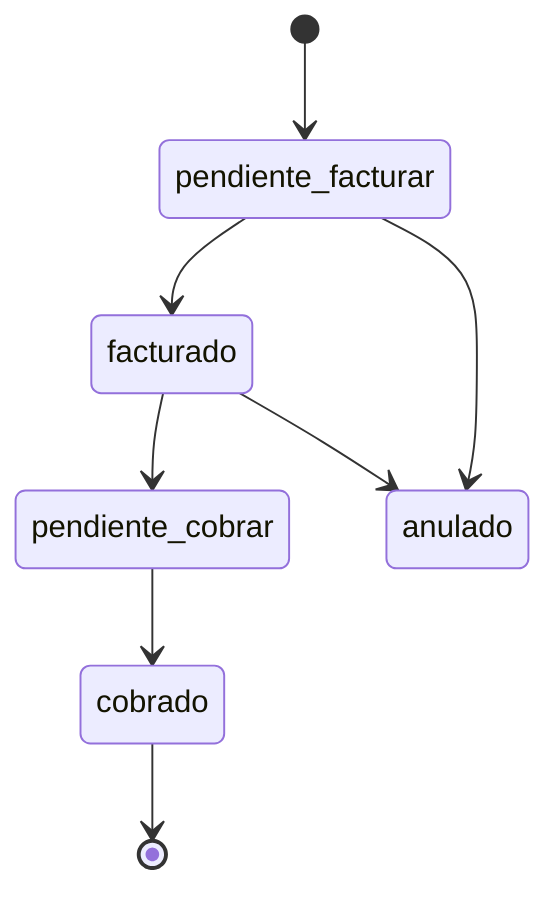

# Plan: Servicios Recurrentes — Inma-ERP

2026-09-21

## Alcance y supuestos

Módulo nuevo dentro del ERP, aislado a nivel de **esquema** (tablas propias; no se agregan ni cambian columnas en `clientes` ni `trabajos`), pero que **consume datos** de todo el sistema: clientes, facturas y, opcionalmente, cotizaciones. Reemplaza el tablero tipo Trello (columnas Pagos Hosting CL/UY, Licencias MS, Starlink/Servidor, Pagos) por una vista equivalente dentro del ERP.

Antes de escribir cualquier migración, Code debe:

1. Revisar el esquema actual (`clientes`, `facturas`, áreas de negocio, monedas) para reusar nombres y convenciones existentes.
2. Confirmar si ya existe algo de "servicios recurrentes" en el sistema, aunque sea básico, para no duplicar.
3. Confirmar el nombre real de la tabla de facturas y de la tabla de áreas de negocio.

## Modelo de datos nuevo

**`recurring_services`** — contrato/plantilla, uno por cliente + servicio

| Campo | Tipo / valores | Notas |
| --- | --- | --- |
| `client_id` | FK → `clientes` |  |
| `pais` | `CL` \| `UY` |  |
| `area_negocio_id` | FK → tabla de áreas existente | ver sección Áreas de negocio |
| `tipo_servicio` | `ms_licencias` \| `hosting` \| `starlink` \| `servidor` \| `otro` |  |
| `descripcion` | texto libre | ej. "23 STD, 3 XCH2, 10 XCH1" o "plan grande" |
| `moneda` | `CLP` \| `UYU` \| `USD` |  |
| `monto_cliente` | numeric | lo que se factura al cliente por período |
| `frecuencia` | `mensual` \| `anual` |  |
| `modalidad_facturacion` | `anticipado` \| `vencido` |  |
| `dia_vencimiento` / `mes_dia_vencimiento` | int / date | según frecuencia |
| `fecha_inicio`, `fecha_fin` | date | `fecha_fin` null = sigue activo |
| `estado` | `activo` \| `pausado` \| `cancelado` | default `activo` |
| `costo_fijo_mensual` | numeric, nullable | Starlink/servidor con costo propio fijo |
| `usa_pool_costo` | boolean | true para licencias MS |
| `cotizacion_ref` | texto/FK, nullable | ver sección Relaciones |

**`recurring_service_occurrences`** — cada ciclo de facturación/cobro; reemplaza al tablero

| Campo | Tipo / valores | Notas |
| --- | --- | --- |
| `recurring_service_id` | FK |  |
| `periodo` | texto, ej. `2026-09` o `2026` |  |
| `fecha_vencimiento_facturar`, `fecha_vencimiento_cobrar` | date |  |
| `monto`, `moneda` | numeric, texto | copiado de la plantilla, editable |
| `estado` | `pendiente_facturar` → `facturado` → `pendiente_cobrar` → `cobrado` \| `anulado` |  |
| `fecha_facturado`, `fecha_cobrado` | date, nullable |  |
| `documento_venta_id` | FK → `facturas`, nullable | ver sección Relaciones |

Constraint: `unique(recurring_service_id, periodo)` — evita duplicados.

**`recurring_service_cost_pools`** + **`recurring_service_cost_allocations`** — solo para lo que se reparte (hoy licencias MS)

| Campo | Tipo / valores | Notas |
| --- | --- | --- |
| `pais`, `tipo_servicio`, `periodo` | — | identifican el pool |
| `monto_total_gasto`, `moneda` | numeric, texto | factura del proveedor |
| `proveedor_id` | FK, nullable |  |

Las `allocations` guardan el reparto proporcional (`monto_cliente` / suma del pool ese período) como snapshot, para no perder trazabilidad histórica si después cambian los servicios activos.

## Reglas de negocio

**Generación automática de ciclos**: cron (Vercel Cron o `pg_cron` en Supabase) corre una vez al mes y crea las `occurrences` que correspondan — mensuales del mes, anuales si el mes coincide con `mes_dia_vencimiento` — para todo `recurring_service` activo.

**Anticipado vs. vencido**: solo cambia qué período describe la occurrence (vencido: la de septiembre factura agosto; anticipado: factura septiembre). No cambia la mecánica de estados.

**Reparto licencias MS**: al cargar la factura del proveedor en un `cost_pool` (país + período), un botón "repartir" calcula y guarda las `allocations` proporcional a `monto_cliente` de las occurrences activas de ese tipo/país/período.

**Starlink y servidor**: no necesitan pool; van directo con `costo_fijo_mensual` en la plantilla, igual todos los meses.

## Cómo entra en la rentabilidad

Los servicios recurrentes no son "trabajos": no nacen de una cotización. No forzarlos dentro de la tabla `trabajos`. Los reportes de margen por cliente/área/período hacen un `UNION` entre el resultado de trabajos y el de `recurring_service_occurrences` (ingreso = `monto`, costo = `costo_fijo_mensual` o `allocation` del pool). Así el margen por cliente queda completo sin tocar la lógica de trabajos existente.

## Relaciones con clientes, facturas y cotizaciones

El módulo no altera el esquema de esas tablas, pero las consume en lectura:

- **`recurring_services.client_id`** → FK a `clientes`, para mostrar nombre/país/contacto y para el reparto proporcional.
- **`recurring_service_occurrences.documento_venta_id`** → FK a `facturas`. Como Nubox viene vinculado al banco y exporta estado de pago por factura, al llegar el import mensual el sistema puede **matchear automáticamente** una factura nueva (mismo cliente, monto similar) con una occurrence `pendiente_facturar` y pasarla sola a `facturado`; si esa factura después figura pagada en Nubox, pasarla sola a `cobrado`. Para Uruguay (carga manual) o clientes que no piden factura, el marcado sigue siendo manual, como ya estaba previsto para esos casos.
- **`recurring_services.cotizacion_ref`** → campo simple (no relación obligatoria), solo para los pocos clientes que piden cotización mensual antes de facturar. Si existe una tabla `cotizaciones`, FK; si es solo un número suelto (como en `trabajos`), texto nullable alcanza. Mantiene la decisión ya tomada de no complicar el ERP con el flujo de OC/cotización para estos clientes.

## Áreas de negocio

`tipo_servicio` mapea 1 a 1 con el área de negocio existente:

| `tipo_servicio` | Área de negocio |
| --- | --- |
| `ms_licencias` | Licencias MS |
| `hosting` | Hosting |
| `starlink` | Starlink |
| `servidor` | Cloud |

`area_negocio_id` se autocompleta al crear el `recurring_service` según esta tabla (FK a la tabla de áreas ya existente en el sistema). Para `tipo_servicio = otro` se elige manualmente. Antes de migrar, Code debe confirmar el nombre exacto de la tabla de áreas y los IDs reales de estas cuatro.

## UI: reemplazo del tablero

- Vista principal: lista/kanban agrupada por tipo de servicio y país, igual a como se usa hoy (badges Facturar/Cobrar/Facturado, fecha en rojo si venció) pero dentro del ERP.
- Acción de un tap para marcar Facturado / Cobrado — mobile-first, en línea con el resto de la carga de costos del sistema.
- Vista de detalle del `recurring_service` para editar el contrato (pausar, cambiar monto, dar de baja).
- Pantalla de "pendientes": todo lo `pendiente_facturar` / `pendiente_cobrar` ordenado por vencimiento — funciona como el recordatorio.

## Migración de los servicios actuales

Carga inicial manual (o CSV) de los servicios que hoy están en el tablero: se crea el `recurring_service` de cada uno con `fecha_inicio` = hoy y se genera a mano la primera `occurrence`. De ahí en más el cron sigue solo.

## Fases de implementación para Code

1. Inspeccionar el esquema actual (`clientes`, `facturas`, áreas de negocio, monedas; si hay algo de servicios recurrentes) — sin crear nada todavía.
2. Migraciones de las tablas nuevas en `inma-erp-dev` (CLI, rama `dev`).
3. CRUD (API routes o server actions) de `recurring_services`.
4. Job/cron de generación de `occurrences`.
5. UI de gestión de servicios + UI de pendientes (reemplazo del tablero) con acciones Facturar/Cobrar.
6. Pool y reparto proporcional de licencias MS.
7. Matching automático de `occurrences` contra el import mensual de facturas de Nubox.
8. Vista/consulta de rentabilidad que une trabajos + servicios recurrentes.
9. Carga de los servicios actuales, pruebas en dev, recién ahí merge a `main`/prod.

## Puntos abiertos a confirmar

- ¿Hosting y Starlink también tienen costo de proveedor a trackear, o solo importa lo que se factura al cliente?
- ¿Alcanza con el dashboard de pendientes dentro del ERP, o hace falta además un recordatorio proactivo (email/WhatsApp)?
- ¿El día de vencimiento de facturar y el de cobrar son siempre el mismo, o a veces se cobra unos días después de facturar?
